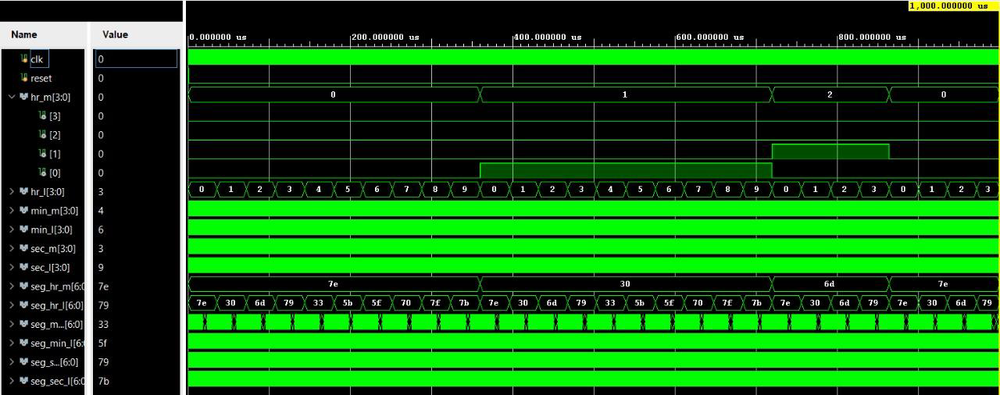
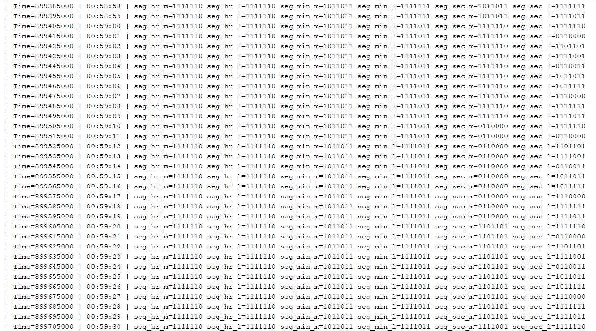

# Real-Time-Clock-Verilog

## Overview

This project implements a **Real Time Clock (RTC)** using **Verilog HDL**.
The design keeps track of **hours, minutes, and seconds** and displays the time in **HH:MM:SS format** using seven-segment display outputs.

The system is simulated using **Xilinx Vivado** to verify correct time progression and display decoding.

---

## Features

* 24-hour time format (00:00:00 to 23:59:59)
* Separate counters for **seconds, minutes, and hours**
* Automatic rollover from seconds → minutes → hours
* Seven-segment display decoder
* Verilog testbench for simulation verification

---

## Tools Used

* **Verilog HDL**
* **Xilinx Vivado Design Suite**

---

## Project Files

* `rtc.v` – Main RTC design module
* `rtc_tb.v` – Testbench for simulation
* `rtc_simulation_waveform.png` – Vivado simulation waveform output
* `rtc_simulation_tcl_console.png` – TCL console simulation output
* `README.md` – Project documentation

---

## Simulation Waveform

The simulation waveform verifies the correct operation of the RTC design.
It shows the **clock signal, reset behavior, and sequential increment of seconds, minutes, and hours counters**.

---

## TCL Console Output

The TCL console output generated during simulation displays the monitored values of **hours, minutes, and seconds in HH:MM:SS format** along with the corresponding seven-segment display signals.
This confirms correct time progression and segment decoding.

---

## Applications

* Digital clocks
* Embedded timing systems
* FPGA-based timers
* Industrial and automation timing applications

---

## Author

**Manoj Kumar Naik Mudu**
